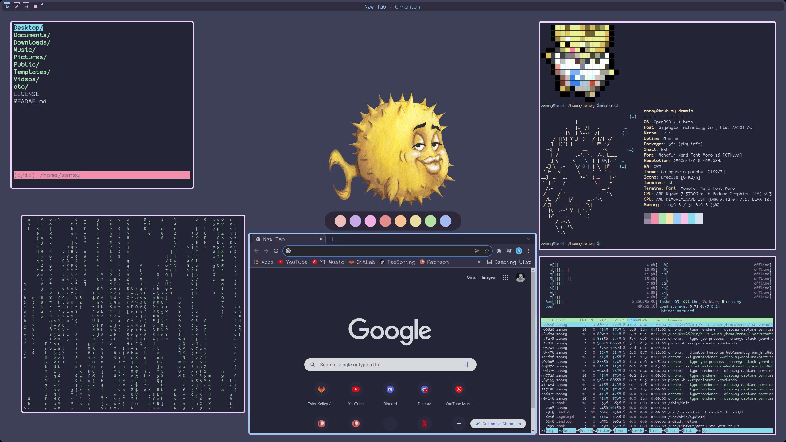

# About My System

This repository is my personal dotfiles. Dotfiles are the files responsible for customization on your Unix(-like) system. This exists so that anyone can see how I have customized my system. The customization and configuration files on Unix(-like) are referred to are dotfiles, because typically they begin with a period.

## What I Use
- dwm (tiling window manager)
- dmenu (program launcher)
- st (terminal)
- fff (file manager)
- cmus (music player)
- discord (messaging - through browser)
- chomium (web browsing)
- kdenlive (video editing)
- htop (system monitoring)
- dunst (notifications)
- picom (compositing - *achieves the rounded corners, transparency, etc*)

### DWM Patches Used
- activetagindicatorbar (puts line at top of populated workspaces)
- alwayscenter (windows spawn centered if floating)
- bar-height
- barpadding
- centeredwindowname
- restartsig (dwm can be restarted instead of having to kill it)
- rotatestack (can move windows up and down in stack)
- vanitygaps (adding the gap aesthetic)
- warp (when changing monitors, or window focus - cursor follows)

### DMENU Patches Used
- allow-color-font (Allows rendering of color emojis)
- border
- center (centers dmenu in the middle of the screen)
- lineheight (set the thickness of dmenu)

# NOTICE
If I am hosting your wallpaper and you would like credit for it or would like to have me remove it from this repository please reach out and I will comply. Thank you.
