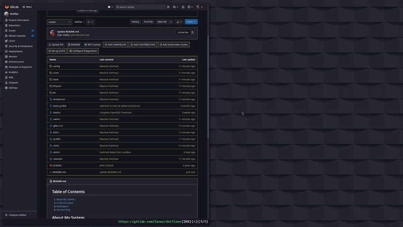

# Table of Contents
1. [About My System](#About)
2. [Script Directory](.local/bin)
3. [Wallpapers](Pictures/Wallpapers)
4. [Xenodm Rice](etc/X11/xenodm)

# About My System 

This repository is my personal dotfiles. Dotfiles are the files responsible for customization on your Unix(-like) system. This exists so that anyone can see how I have customized my system. The customization and configuration files on Unix(-like) are referred to are dotfiles, because typically they begin with a period.

## What I Use
- cwm (window manager)
- rofi (program launcher)
- xterm (terminal)
- fff (file manager)
- cmus (music player)
- feh (Setting Wallpaper & Image Viewer)
- mpv (video player)
- discord (messaging - through browser)
- qutebrowser (web browsing)
- kdenlive (video editing)
- top (system monitoring)
- dunst (notifications)
- picom (compositing - *achieves the rounded corners, transparency, etc*)
